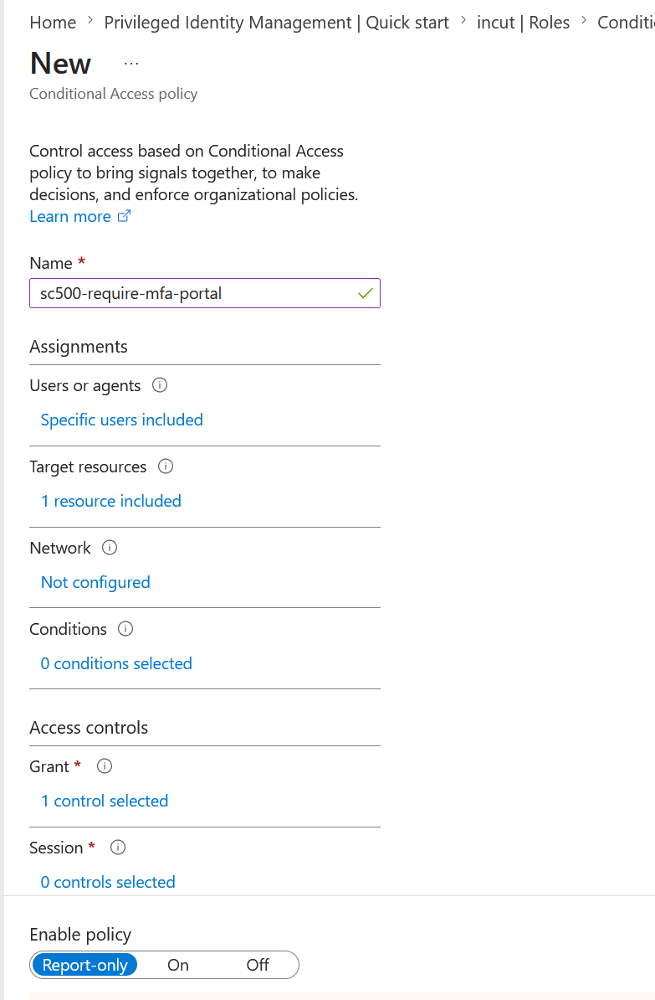
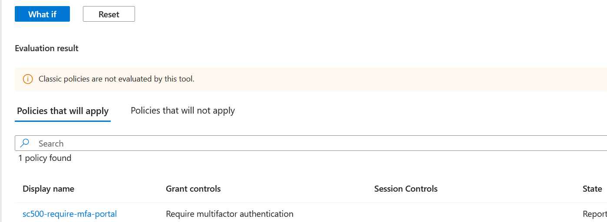
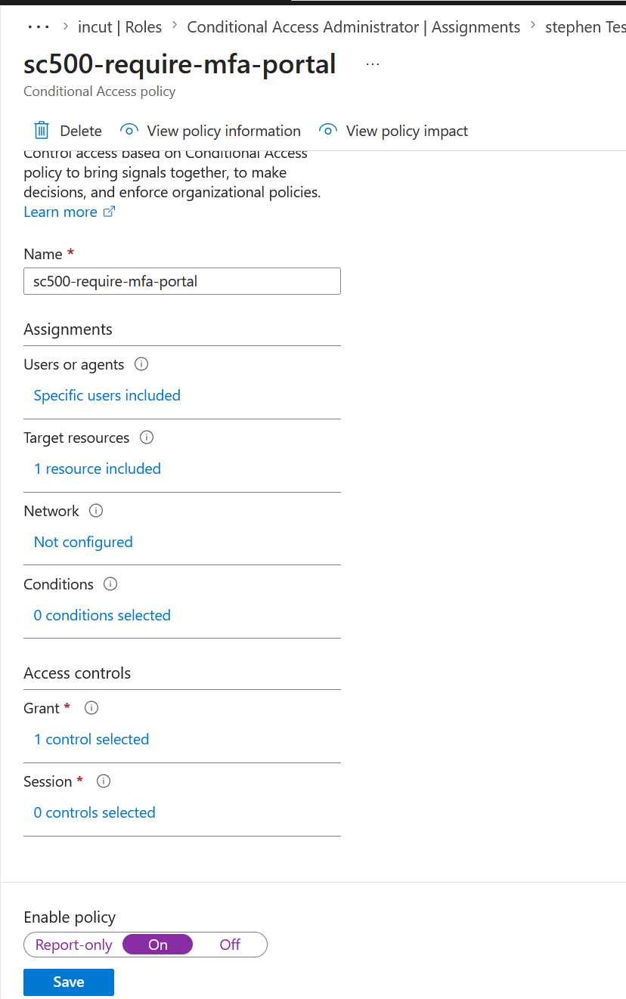
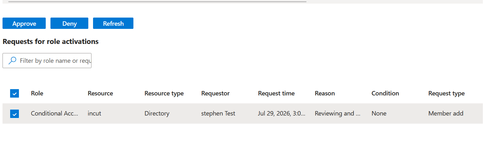
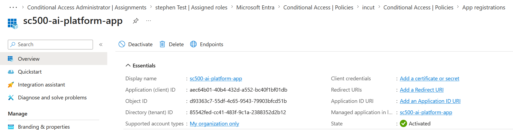

# SC-500 Lab 1B: Enforce MFA with Conditional Access

## Lab Overview

In this lab, I replaced Microsoft Entra Security Defaults with a Conditional Access policy that enforces Multi-Factor Authentication (MFA) for a selected user. Before enabling the policy, I validated its behaviour using the *What If* simulation tool in *Report-only* mode. After validating the policy, I enabled enforcement, verified the MFA challenge during sign-in, and completed the lab by registering an application in Microsoft Entra ID with Microsoft Graph delegated permissions following the principle of least privilege.

---

# Skills Demonstrated

- Microsoft Entra ID Administration
- Conditional Access
- Multi-Factor Authentication (MFA)
- Report-only Mode
- What If Simulation
- Microsoft Entra App Registration
- Microsoft Graph API Permissions
- Identity and Access Management
- Zero Trust Security
- Principle of Least Privilege

---

# Lab Objectives

- Disable Microsoft Entra Security Defaults.
- Create a Conditional Access policy.
- Validate the policy using the What If simulation tool.
- Enable the Conditional Access policy.
- Verify MFA enforcement.
- Register an application in Microsoft Entra ID.
- Configure delegated Microsoft Graph API permissions.

---

# Production Scenario

An organisation currently relies on Microsoft Entra Security Defaults to secure user identities. While Security Defaults provide a baseline level of protection, they cannot deliver the flexibility required for enterprise environments.

The security team has decided to migrate to Conditional Access, allowing MFA to be enforced only for selected users accessing Microsoft 365 resources. Before deploying the policy into production, the team validates its behaviour using Report-only mode and the What If simulation tool. Finally, a new application is registered in Microsoft Entra ID and granted delegated Microsoft Graph permissions using the principle of least privilege.

---

# Prerequisites

- Microsoft Entra ID tenant
- Global Administrator account
- Microsoft Authenticator configured
- Microsoft Entra Admin Center

---

# Part 1 - Disable Microsoft Entra Security Defaults

## Navigation

Microsoft Entra Admin Center

→ Microsoft Entra ID

→ Overview

→ Properties

→ Access management for Azure resources

→ Security defaults

→ Manage Security Defaults

---

## Procedure

1. Open *Manage Security Defaults*.

2. Change *Security Defaults* to:

Disabled

3. Select the reason:

My organization is planning to use Conditional Access

4. Select *Save*.

5. Confirm by selecting *Disable*.

---

## Validation

Verify the following notification appears.

Successfully disabled security defaults policy.

> *Note:* Depending on the Microsoft Entra tenant configuration, the Security Defaults option may only become visible after enabling *Access management for Azure resources*.

---

# Part 2 - Create the Conditional Access Policy

## Navigation

Microsoft Entra Admin Center

→ Microsoft Entra ID

→ Conditional Access

→ Policies

→ New Policy

---

## Configure the Policy

### Policy Name

sc500-require-mfa-portal

---

### Users

Select

Users

Choose

Select users and groups

Select

Stephen Test

Click

Select

---

### Target Resources

Select

Target resources

Choose

Microsoft 365

---

### Grant

Select

Grant

Enable

Require multifactor authentication

Click

Select

---

### Enable Policy

Set

Report-only

Click

Create

---

## Validation

Verify:

- Policy Name = *sc500-require-mfa-portal*
- State = *Report-only*

### Screenshot

Figure 1: Conditional Access policy successfully created in Report-only mode.

---

# Part 3 - Validate the Policy Using What If

## Navigation

Conditional Access

→ What If

---

## Configure

Identity

Stephen Test

Target Resource

Microsoft 365

Device Platform

Windows

Client App

Browser

Leave every remaining option at its default value.

Select

What If

---

## Validation

Confirm the simulation displays:

Policy

sc500-require-mfa-portal

Grant Control

Require multifactor authentication

This confirms the policy will apply correctly when enabled.

### Screenshot

Figure 2: The What If simulation confirms that the Conditional Access policy will enforce MFA for the selected user.

---

# Part 4 - Enable the Conditional Access Policy

## Navigation

Conditional Access

→ Policies

→ sc500-require-mfa-portal

---

## Procedure

Change

Enable Policy

to

On

Select

Save

---

## Validation

Verify:

- Policy Status = *On*

### Screenshot

Figure 3: Conditional Access policy successfully enabled.

---

# Part 5 - Verify MFA Enforcement

## Procedure

1. Open a new InPrivate browser.

2. Sign in as:

Stephen Test

3. Access Microsoft 365.

4. Approve the Microsoft Authenticator request.

5. Complete Number Matching.

---

## Validation

Verify:

- Microsoft Authenticator prompts for MFA.
- Number Matching is completed successfully.
- Microsoft 365 loads successfully.

### Screenshot

Figure 4: MFA approval request displayed in Microsoft Authenticator during sign-in.

---

# Part 6 - Register an Application

## Navigation

Microsoft Entra Admin Center

→ Applications

→ App registrations

→ New registration

---

## Configure

Application Name

sc500-ai-platform-app

Supported account type

Accounts in this organizational directory only (Single tenant)

Redirect URI

Leave blank

Click

Register

---

## Validation

Verify the Overview page displays:

- Application (client) ID
- Object ID
- Directory (tenant) ID

### Screenshot

Figure 5: Application successfully registered in Microsoft Entra ID.

---

# Part 7 - Configure Microsoft Graph API Permissions

## Navigation

Application Registration

→ API Permissions

→ Add a permission

---

## Procedure

Select

Microsoft Graph

Select

Delegated permissions

Search

User.Read

Expand

User

Select

User.ReadBasic.All

Click

Add permissions

---

## Validation

Verify the following permission appears.

| Permission | Type |
|------------|------|
| User.ReadBasic.All | Delegated |

Admin Consent Required

No

---

# Lessons Learned

- Security Defaults provide baseline protection but lack the flexibility of Conditional Access.
- Report-only mode enables safe testing before enforcing a Conditional Access policy.
- The What If simulation tool is valuable for validating policy behaviour without affecting users.
- MFA Number Matching strengthens authentication by reducing the risk of MFA fatigue attacks.
- Microsoft Graph delegated permissions should always follow the principle of least privilege.
- Microsoft Entra navigation may vary between tenants, requiring administrators to adapt while achieving the same security outcome.

---

# Business Benefits

- Enables Zero Trust identity protection.
- Reduces the risk of compromised credentials.
- Provides granular control over MFA enforcement.
- Supports staged deployment using Report-only mode.
- Protects Microsoft 365 resources through Conditional Access.
- Applies least privilege when granting application permissions.

---

# Lab Outcome

Successfully completed:

- ✅ Disabled Microsoft Entra Security Defaults.
- ✅ Created a Conditional Access policy.
- ✅ Validated the policy using the What If simulation.
- ✅ Enabled Conditional Access.
- ✅ Verified Multi-Factor Authentication.
- ✅ Registered a Microsoft Entra application.
- ✅ Configured Microsoft Graph delegated permissions.
- ✅ Applied Zero Trust and least privilege security principles.
